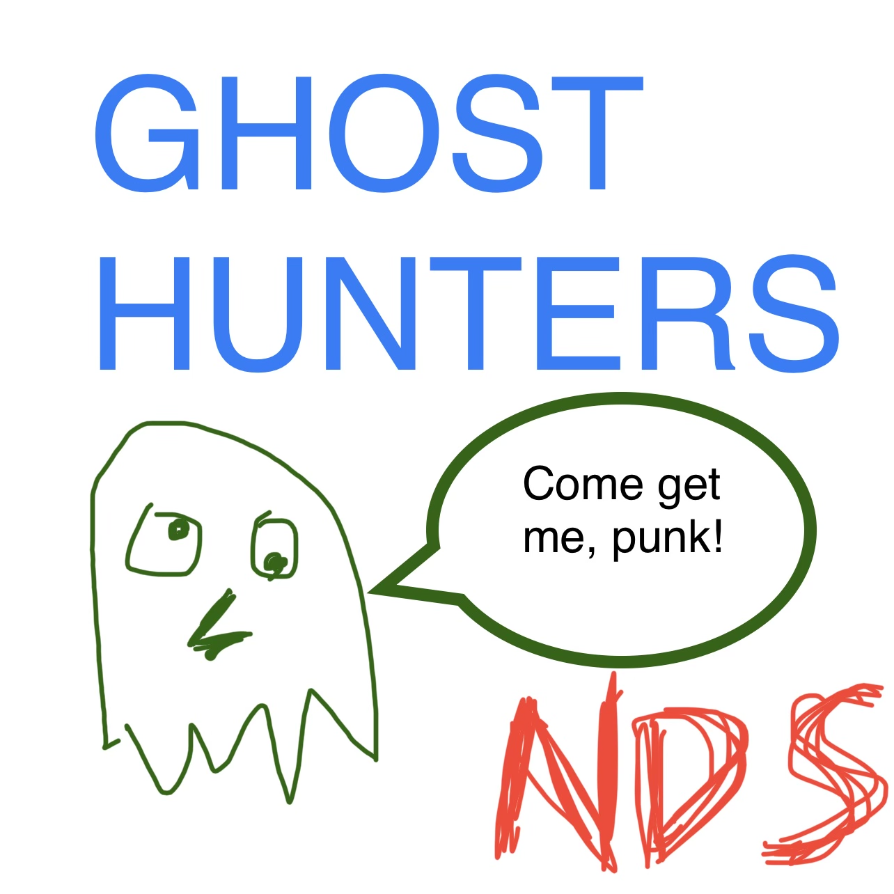

<!DOCTYPE html>
<html lang="en-US">

<head>
  <meta charset="utf-8">

  <link rel="stylesheet"
    href="https://cdn.jsdelivr.net/gh/Microsoft/vscode/extensions/markdown-language-features/media/markdown.css">
  <link rel="stylesheet"
    href="https://cdn.jsdelivr.net/gh/Microsoft/vscode/extensions/markdown-language-features/media/highlight.css">

</head>

<body class="vscode-body vscode-light">
  

    
  

  <h1 align="center">NDS Ghost Hunter</h1>
  
<i>by Neher Data Systems!</i>

  

  
<a href="http://www.neherdata.com">Website</a> • <a
        href="mailto:tyler@neherdata.com?cc=joe@neherdata.com&amp;subject=Contact%20Us%20-%20Found%20on%20GitHub">Email
        Us</a> • <a href="https://twitter.com/neherdata">Twitter</a> • <a
        href="https://www.facebook.com/neherdata">Facebook</a> • <a href="https://instagram.com/neherdata">Instagram</a>
    

[![Deploy Ghost Hunter Landing Page [ghosthunter.neherdata.com] to GitHub Pages](https://github.com/neherdata/ghosthunter.neherdata.com/actions/workflows/static.yml/badge.svg)](https://github.com/neherdata/ghosthunter.neherdata.com/actions/workflows/static.yml)
